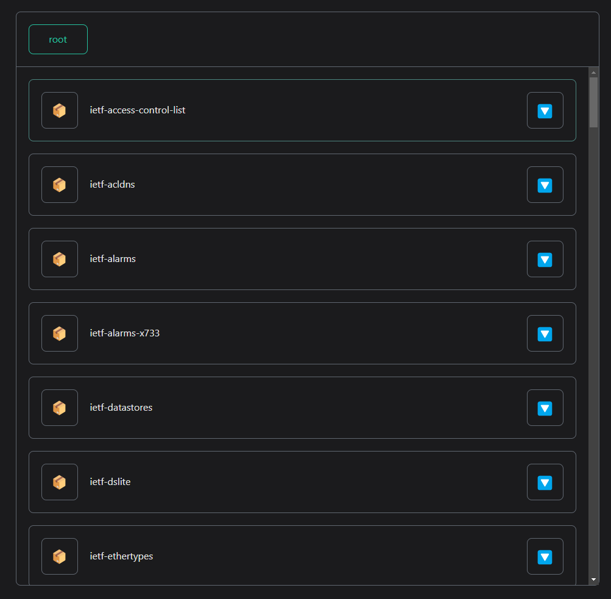
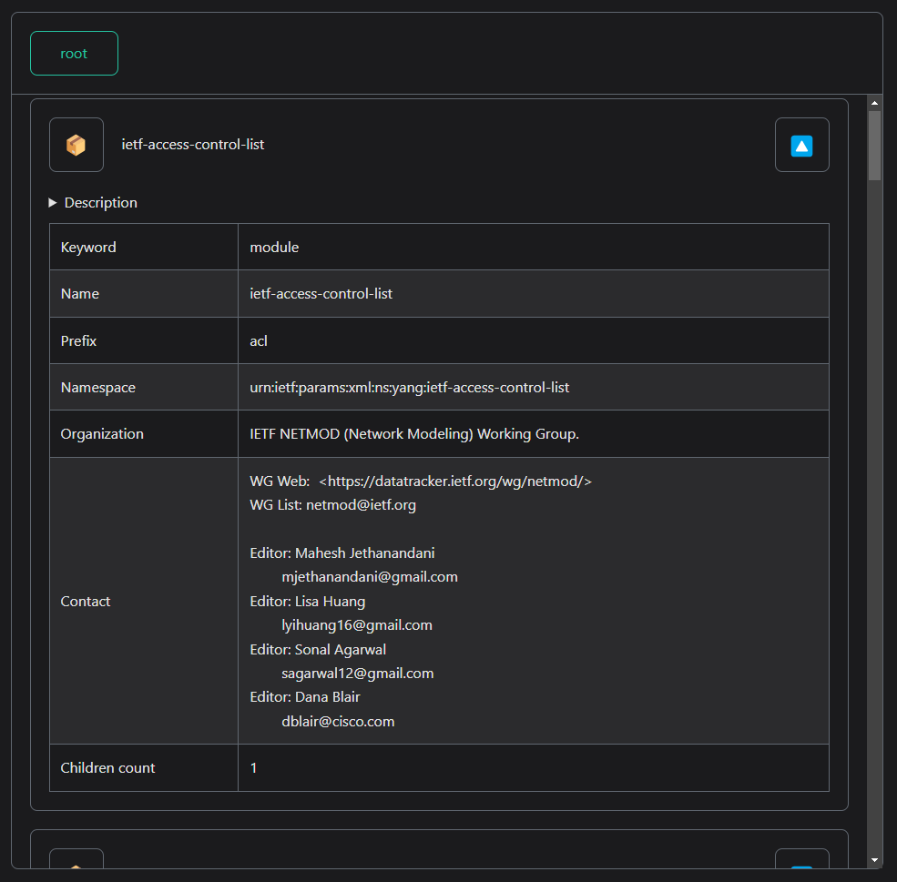
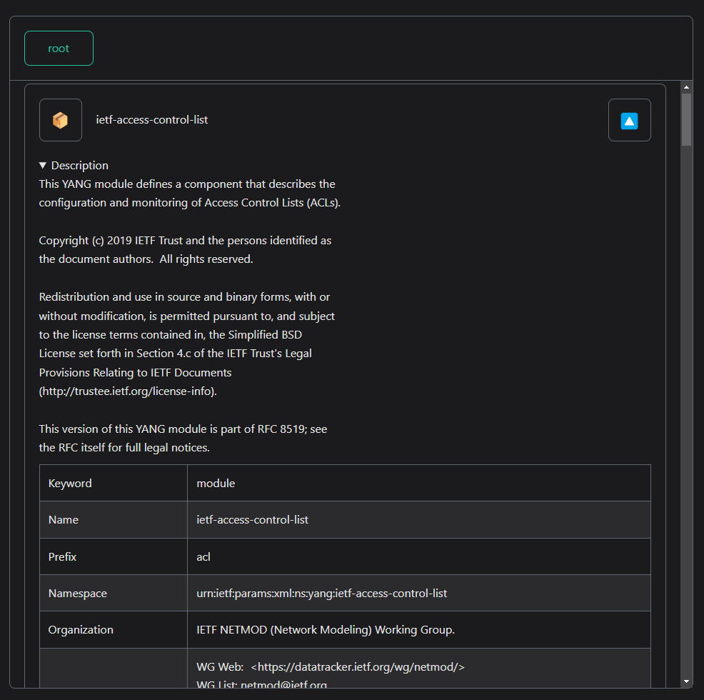
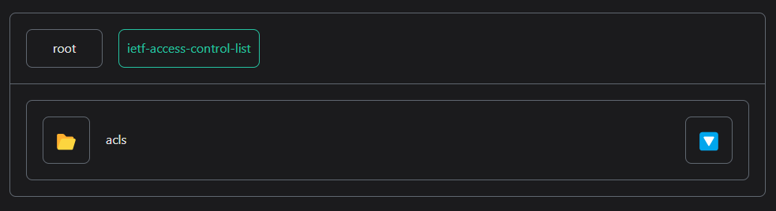
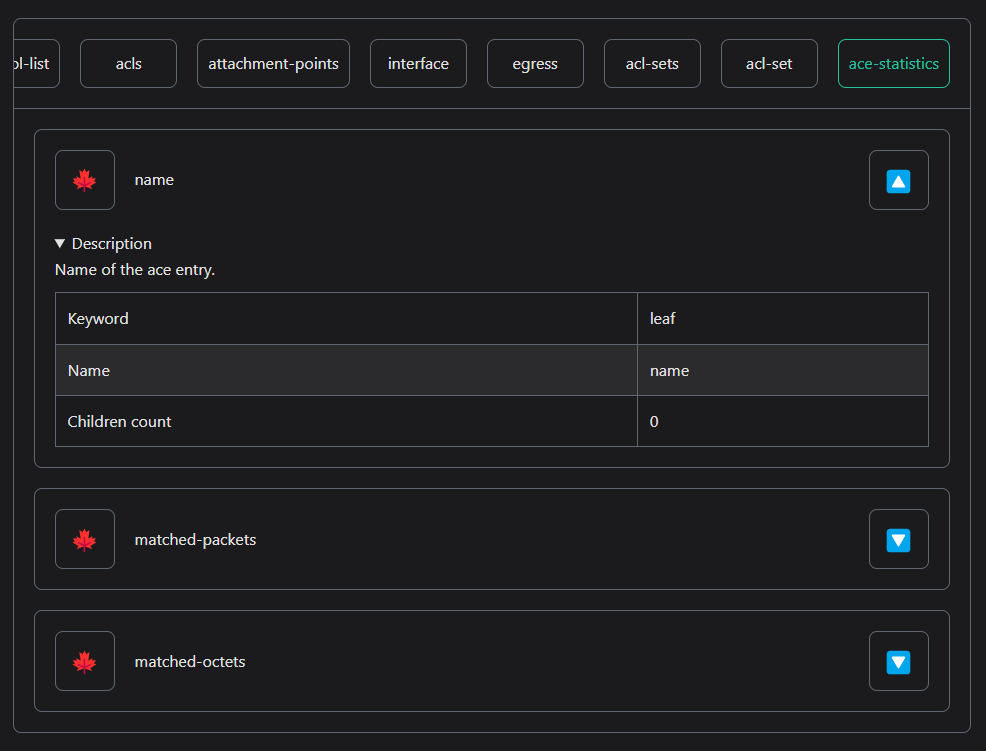

# Yang Tree Viewer

Web component for displaying YANG schema contents.

The component is currently available only for react.js framework.

Vue.js will be supported in the future.

_Developed primarily for use with [docusaurus] docs framework._

## Usage

- Generate json formatted data.
- Embed the component on your page.

**Embed example in a .mdx file**

```mdx
import YangTreeViewer from "./components/YangTreeViewer"
import data from "./src/data/example-data.json"

<YangTreeViewer tree={data} sm-sort="true"></YangTreeViewer>
```

## Screens

### Tree root view



### Expanded module node view



### Description of the node



### Child node view



### Leaf node view



## License

[GPLv3][] © [Jakub Holcman][]

[jakub holcman]: https://jakub-holcman.com
[GPLv3]: LICENSE
[docusaurus]: https://docusaurus.io
